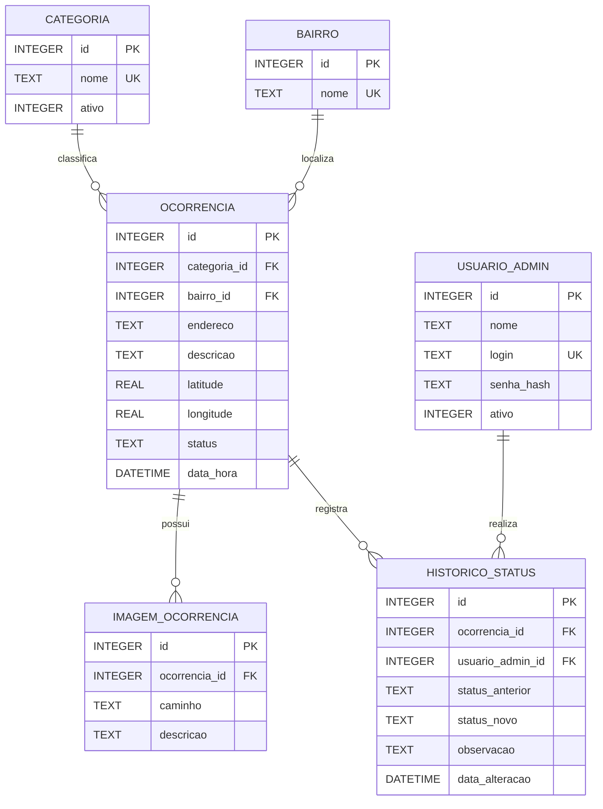

# Modelo de dados - Memória Urbana Inteligente

O banco foi modelado para representar as ocorrências urbanas registradas pela aplicação e preservar informações necessárias para consultas históricas e administrativas.

## Entidades

- **categoria**: tipos de problema urbano, como alagamento, buraco e iluminação.
- **bairro**: bairros utilizados para agrupamento e análise das ocorrências.
- **usuario_admin**: usuários responsáveis por ações administrativas.
- **ocorrencia**: registro principal do problema urbano.
- **imagem_ocorrencia**: imagens vinculadas a uma ocorrência.
- **historico_status**: histórico das alterações de situação de cada ocorrência.

## Relacionamentos

- Uma categoria pode possuir várias ocorrências.
- Um bairro pode possuir várias ocorrências.
- Uma ocorrência pode possuir várias imagens.
- Uma ocorrência pode possuir vários registros de histórico.
- Um usuário administrativo pode ser responsável por várias alterações de status.

## Diagrama ER

## Restrições principais

- Nomes de categorias e bairros não podem se repetir.
- Login administrativo deve ser único.
- Toda ocorrência deve estar associada a uma categoria e a um bairro existentes.
- Latitude deve estar entre -90 e 90.
- Longitude deve estar entre -180 e 180.
- O status da ocorrência deve ser `Aberta`, `Em análise` ou `Resolvida`.
- Imagens e registros de histórico são removidos automaticamente quando a ocorrência correspondente é excluída.
